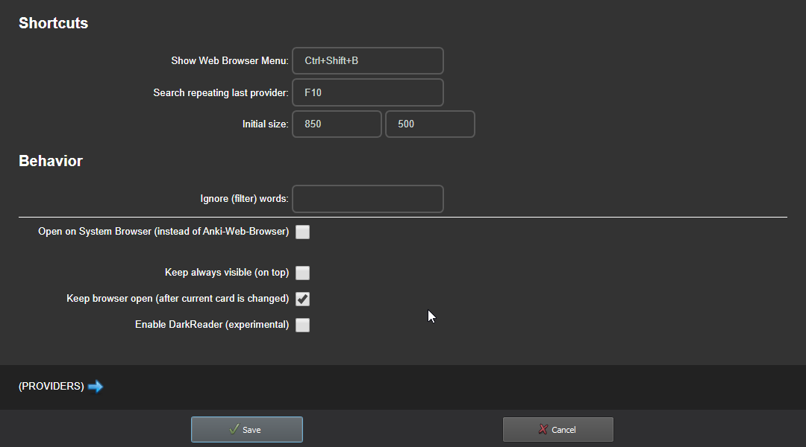
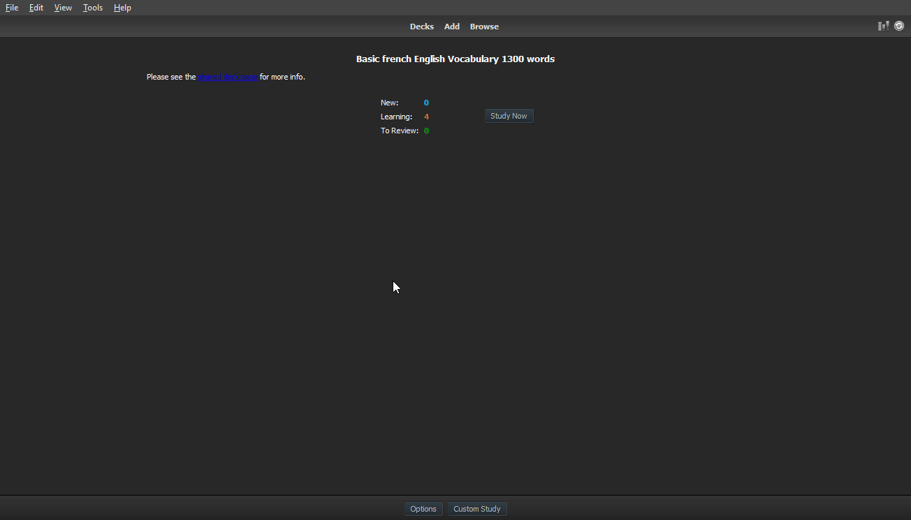
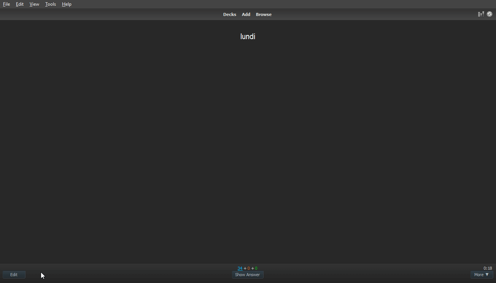
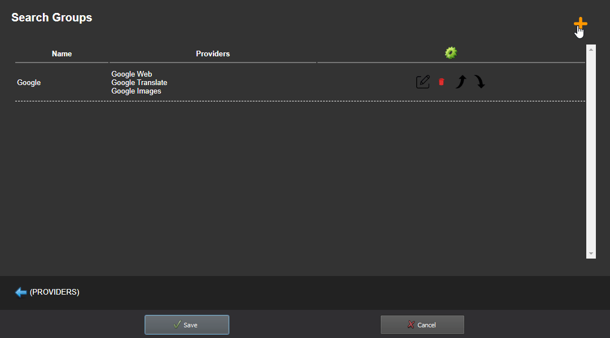

# Anki Web Browser

> Previously this was in https://github.com/ssricardo/anki-plugins repository. 

The **Anki Web Browser** is a simple Internet Browser within Anki (as the name suggests).  
It aims to make it easy when you are studying or editing a card and want to look something up on the internet.  
You can also use it to open up your system desktop instead of the embedded browser

For instance, you are studying a foreign language and suddenly there is a word which you haven't properly understood. In such case it's common to shift to the web browser and search for the term there. 
This add-on makes this task smoother.  

Therefore, this addon provides 2 functionalities:  

* Search the selected text in a website
  * Or use one of the _no selection_ options (*from version 3.0*)
* Import text and images directly from a website to current card

> [ TODO ] Some preview images below need to be updated, as current version has many improvements like Tabs

To check new features, check out [Release notes](RELEASE_NOTES)

## Configuration

In order to search something on a website, the user is given a list of registered websites to choose from. This list is called **providers**.  
In the Configurations view, the user may specify the providers that will be available.  

The *web browser* may close itself when the user shifts cards, that is, when a new card is shown as opposed to the one which was used for a query.  
This feature may be *enabled* or *disabled* using the configuration **Keep card opened**.  

The config **Always on top** is intuitive. It means that if enabled, when the *web browser* is shown, it remains above everything. This might be useful when editiing several notes.  

The config **Use System Browser** disabled the embedded web browser. With this the addons invokes the system web browser instead. Both the provider and the queried term will be used likewise.  

There are 2 **shortcuts** available, which are customizable:

* Show Web Browser menu: It's the same as right click, but it shows the Anki Web Browser only menu 
* Search again, repeating last provider: Skip the *Select a provider* part (See more below)

It's possible to automatically remove/strip some words from the text to be searched. These words are specified on **Filter following words** (separated by spaces).  

> From version 3.0

**Initial size**: Define the browser window size, when opened for the first time in the session (*From 4.0*)

**Enable DarkReader** refers to a feature to use Dark mode on the browser (still under development/tests)
 
## Using

The functions of this add-on are accessed through the context menu (either *right click* on mouse or *right menu key* on the keyboard) or using shortcuts.  

### Search selected text

While studying or editing a given card:  

* Select a word or sentence
* Right click (or use the shortcut)
* *Search on Web*
* Select the desired provider

Then a new window with the *web browser* will be opened, if it isn't opened yet.  

### Search without selection (No selection option)

> From version 3.0+

If no text is selected for the search, the user may selected other option (following):

* Type in the term to look up
* Use the content of one of the fields on current card
* Do nothing (just expect a text selected)

With the 2nd and 3rd options, it's possible to *memorize* the selected option. 
This way, the user won't be prompted about *no selection option* anymore, **in the current Anki session**.  

#### Query a new word with same provider

If the user have already used this addon in the current Anki session, this action opens up the web browser without asking to choose a provider.  
It's going to use the same as the last query. 

Conversely, if it's the first query in the current session, the menu will be shown.

### Get data directly from the web browser

When using this addon while adding or editing a note, it's possible to get text and images from the opened website to the card.  

After looking something up with the previous steps (above), on the *web browser*:  

* Select some text and then *right click* OR just *right click* over an image
* *Assign to field*
* A list with the fields from the source card is shown
* Choose one of them

This way, the text or image will be appended to the selected field.  
Even the image! (It's downloaded and imported into the collection automatically) (Check the restriction below)  

This feature makes it really simple and fast to get some information from the Internet and build or improve your Anki's collection.  

> This feature works only using the embedded web browser. If you use the system browser, it's not possible to get data automatically

#### Repeat assignment

> From version 3.0

To speed up this process, here it's also possible to repeat the last action; that is, assign the content to the same field used last time (**on current Anki session**). 

To do this, just *hold Ctrl* when right-clicking on some selected text or image.

### Group Search

> From version 5.0 

Search in multiple websites (providers) in one shot. In the configurations, you can select a set of providers and save as a group.
Later, in the search options, the groups are shown in the top. 
This provider a high productivity. With 2 clicks, it's possible to search in many websites. 
(Or even with a single click, using the _repeat_ feature)

## Limitation

The image downloading supports only URLs finished with image suffix (like png, jpg)...
This add-on uses Anki engine to perform that action, and Anki imposes that restriction.  

## Bugs / Suggestions / more...

Please, feel free to ~~make suggestions and~~ open issues for possible bugs found.  

> Unfortunately I won't have time to implement new features for a while
